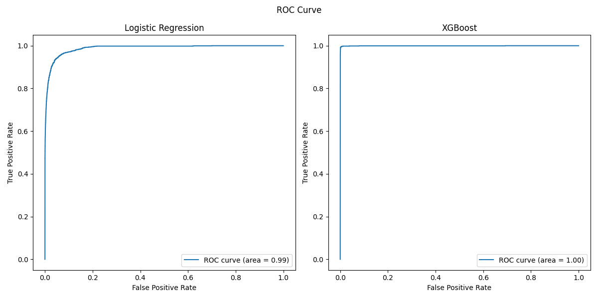
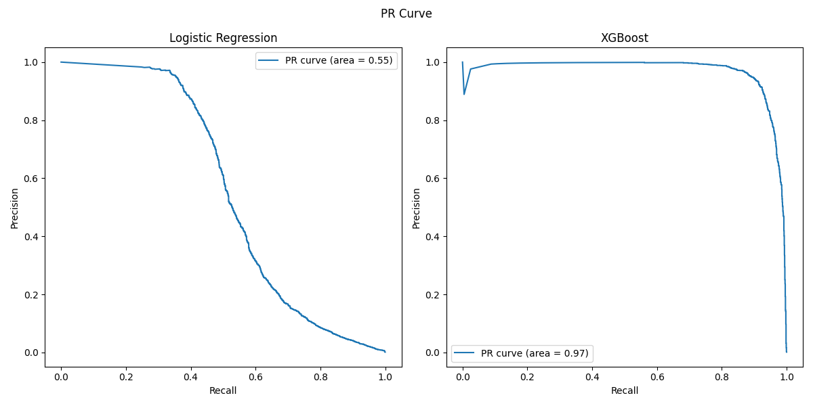
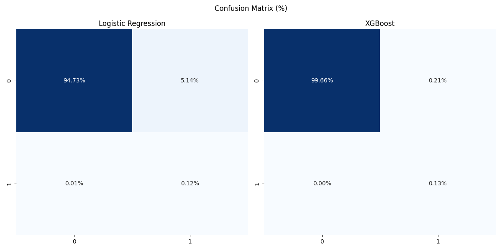

# Argo Workflows: DAG Pipelines on Kubernetes

A multi-stage ML pipeline built with Argo Workflows on Kind (Kubernetes in Docker), demonstrating DAG vs. step execution models, artifact passing via MinIO (S3), and retry/fault-tolerance behavior. 

The pipeline performs training and evaluation of fraud detection models using the [PaySim dataset](https://www.kaggle.com/datasets/mtalaltariq/paysim-data/data). The dataset contains 6,362,620 samples with 11 features and is highly imbalanced, with the target distribution of approximately 99.87% normal transactions and 0.13% fraudulent transactions.


## Overview

This project benchmarks Argo Workflows execution strategies for an end-to-end fraud detection ML pipeline:

- **DAG template** — tasks declare explicit dependencies, enabling parallel execution where possible
- **Steps template** — tasks execute strictly sequentially, step by step
- **Artifacts** — intermediate data is passed between steps via MinIO (S3-compatible object storage)
- **Fault tolerance** — the validation step randomly exits with an error (~30% probability in non-benchmark mode) to test `retryStrategy`

---

## Architecture

```
                        ┌─────────────────┐
                        │ Data Validation │  <- raw CSV from MinIO S3
                        └────────┬────────┘
                                 │
                        ┌────────▼────────┐
                        │  Preprocessing  │  <- scaling, feature engineering
                        └────────┬────────┘
                                 │
                        ┌────────▼────────┐
                        │Handle Imbalance │  <- SMOTE + train/test split
                        └────┬───────┬────┘
                             │       │
               ┌─────────────▼─┐   ┌─▼─────────────┐
               │  Train LR     │   │ Train XGBoost │  <- parallel (DAG only)
               └──────┬────────┘   └────────┬──────┘
                      │                     │
               ┌──────▼─────────────────────▼───────┐
               │           Plot Results             │
               └────────────────────────────────────┘
```

Artifacts (NumPy arrays, JSON metrics, joblib models) flow between steps via MinIO. The DAG workflow runs the two training steps in parallel; the steps workflow runs them sequentially.

---

## Pipeline Steps

### 1. Data Validation (`01_data_validation.py`)

Loads the raw CSV and produces a JSON report containing:
- Row/column counts
- Missing value check
- Expected column presence (exits with code 1 if any are missing)
- Class distribution and fraud percentage

In non-benchmark mode, the script randomly fails with 30% probability to simulate real-world flakiness, exercising the retry logic.

**Output:** `data-validation-report.json`

### 2. Preprocessing (`02_preprocessing.py`)

- Drops identifier columns (`nameOrig`, `nameDest`)
- Engineers features: `orig_balance_diff`, `dest_balance_diff`, `dest_was_zero`, `orig_was_zero`
- One-hot encodes the `type` column
- Scales all numeric features with `StandardScaler`

**Output:** `X_processed.npy`, `y.npy`, `scaler.joblib`, `feature_names.json`

### 3. Handle Imbalance (`03_handle_imbalance.py`)

- Stratified 80/20 train-test split
- Applies SMOTE on the training set to balance classes

**Output:** `X_train_res.npy`, `y_train_res.npy`, `X_test.npy`, `y_test.npy`

### 4. Train Logistic Regression (`04_train_lr.py`)

Trains a `LogisticRegression` (SAGA solver) and evaluates on the held-out test set.

**Output:** `model_lr.joblib`, `metrics_lr.json`

### 5. Train XGBoost (`05_train_xgb.py`)

Trains an `XGBClassifier` and evaluates on the held-out test set.

**Output:** `model_xgb.joblib`, `metrics_xgb.json`

### 6. Plot Results (`06_plot_results.py`)

Generates side-by-side plots for both models: Confusion Matrix (%), ROC Curve, and PR Curve.

**Output:** `cm.png`, `roc_curve.png`, `pr_curve.png`

---

## ML Results

### Metrics Summary

| Metric     | Logistic Regression | XGBoost |
|------------|--------------------:|--------:|
| ROC-AUC    | 0.99                | 1.00    |
| PR-AUC     | 0.55                | 0.97    |


PR-AUC is the most meaningful metric here due to heavy class imbalance. XGBoost (0.97) dramatically outperforms Logistic Regression (0.55).

### ROC Curve



Both models achieve high ROC-AUC (0.99 / 1.00), but ROC-AUC can be misleading on imbalanced datasets.

### PR Curve



XGBoost maintains near-perfect precision across nearly the full recall range (PR-AUC = 0.97). Logistic Regression degrades sharply after ~35% recall (PR-AUC = 0.55), struggling to maintain precision on the minority fraud class.

### Confusion Matrix



XGBoost misclassifies only 0.21% of legitimate transactions as fraud, compared to 5.14% for Logistic Regression - a significant improvement in false positive rate, which matters greatly in production fraud systems.

---

## Experiments

### DAG vs. Steps Benchmark

The key structural difference is that the DAG template can run `train-lr` and `train-xgb` in parallel, since both depend only on the imbalance step output.

| Workflow              | Duration |
|-----------------------|----------|
| `pipeline_steps`      | 5m 15s   |
| `pipeline_dag`        | 4m 45s   |

The DAG saved about 30 seconds by parallelising the two training steps. For heavier models or larger datasets, this gap would widen substantially.

The benchmark variants (`pipeline_*_benchmark.yaml`) pass `--benchmark True` to the validation step, disabling the random failure injection for clean timing measurements.

### Artifact Passing

Artifacts flow between pipeline steps via **MinIO** (S3-compatible object storage deployed in the argo namespace). Each step writes outputs to `/data/out`, which Argo archives to MinIO. The next step receives those artifacts at `/data/in`.

```
Step A  ->  /data/out  ->  MinIO bucket  ->  /data/in  ->  Step B
```

This approach decouples steps entirely: each container is stateless, and artifacts are durable between retries.

MinIO is deployed alongside Argo in the argo namespace (`k8s/minio-setup.yaml`). The API runs on port 9000.

### Fault Tolerance & Retry

The validation step (`01_data_validation.py`) randomly exits with code 1 when `--benchmark` is not set, simulating flaky pipeline steps.

All steps are configured with:

```yaml
retryStrategy:
  limit: "3"
  retryPolicy: "OnFailure"
```

This means Argo will retry any failed step up to 3 times before marking the workflow as failed. In practice this means the validation step will almost always succeed within 3 attempts even with 30% failure probability (~97.3% success rate over 3 tries).

---

## Prerequisites

- Docker
- Kind
- kubectl
- Argo Workflows 
- Python 3.11+ 

---

## Setup

### 1. Start Kind cluster and install Argo Workflows

```bash
kind create cluster
kubectl create namespace argo
kubectl apply -n argo -f https://github.com/argoproj/argo-workflows/releases/download/v3.5.0/install.yaml
```

### 2. Deploy MinIO

```bash
kubectl apply -f k8s/minio-setup.yaml -n argo
```


### 3. Upload dataset to MinIO

```bash
# Port-forward MinIO
kubectl port-forward deployment/minio -n argo 9000:9000 9001:9001
```

Open http://localhost:9001, log in with `admin` / `password`, create a bucket named `my-bucket`, and upload `paysim_dataset.csv`.

### 4. Build and load Docker images into Kind

Each pipeline step requires its own Docker image. The images are built using Dockerfiles located in the `/scripts` directory (`Dockerfile.*`). After building, they must be loaded into the Kind cluster to make them available for Argo Workflows execution.

---

## Running the Pipelines

### Access Argo UI

```bash
kubectl -n argo port-forward deployment/argo-server 2746:2746
```

Open https://localhost:2746.

### Access MinIO console

```bash
kubectl port-forward deployment/minio -n argo 9000:9000 9001:9001
```

Open http://localhost:9001

login: `admin` 

password:  `password`

### Submit workflows

```bash
# DAG pipeline (parallel training)
kubectl create -f k8s/pipeline_dag.yaml -n argo

# Steps pipeline (sequential)
kubectl create -f k8s/pipeline_steps.yaml -n argo

# DAG benchmark (no random failures, for timing)
kubectl create -f k8s/pipeline_dag_benchmark.yaml -n argo

# Steps benchmark (no random failures, for timing)
kubectl create -f k8s/pipeline_steps_benchmark.yaml -n argo
```

### Monitor execution

```bash
# Watch workflow status
kubectl get workflows -n argo -w

# Get logs for a specific pod
kubectl logs -n argo <pod-name>
```

---

## Project Structure

```
├── k8s/
│   ├── minio-setup.yaml              # MinIO Deployment + Service
│   ├── pipeline_dag.yaml             # DAG workflow (with fault injection)
│   ├── pipeline_dag_benchmark.yaml   # DAG workflow (clean benchmark)
│   ├── pipeline_steps.yaml           # Steps workflow (with fault injection)
│   └── pipeline_steps_benchmark.yaml # Steps workflow (clean benchmark)
├── scripts/
│   ├── 01_data_validation.py           
│   ├── 02_preprocessing.py             
│   ├── 03.handle_imbalance.py
│   ├── 04_train_lr.py        
│   └── 05_train_xgb.py
│   ├── 06.plot_results.py
│   ├── Dockerfile.imbalance      
│   └── Dockerfile.plot
│   ├── Dockerfile.preprocessing
│   ├── Dockerfile.train_lr         
│   └── Dockerfile.train_xgb
│   ├── Dockerfile.validation
│   ├── build_and_load.sh          
├── out/
│   ├── roc_curve.png
│   ├── pr_curve.png
│   └── cm.png
└── README.md
```


